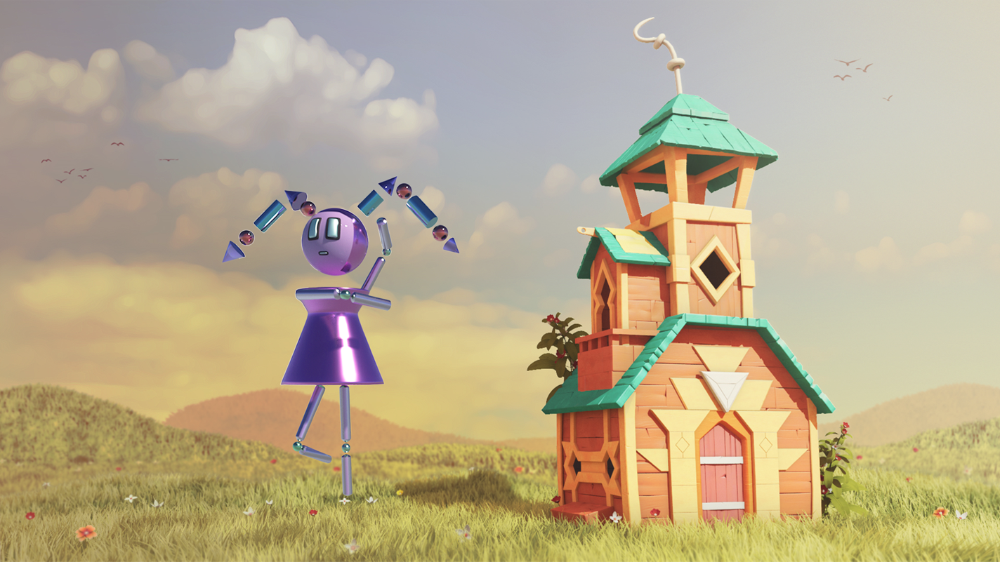

# MON PORTFOLIO

## Projet finale de fin session 4 en Animation 3D et sonorisation

<iframe width="560" height="315" src="https://www.youtube.com/embed/Ymdzi_aRClY?si=NrR40YVulSmvIkut" title="YouTube video player" frameborder="0" allow="accelerometer; autoplay; clipboard-write; encrypted-media; gyroscope; picture-in-picture; web-share" allowfullscreen></iframe>

## Animation générative session 4

<iframe width="560" height="315" src="https://www.youtube.com/embed/ZPlIBzpbd74?si=RUe6Yk58LknnGXyR" title="YouTube video player" frameborder="0" allow="accelerometer; autoplay; clipboard-write; encrypted-media; gyroscope; picture-in-picture; web-share" allowfullscreen></iframe>

## Modélisation d'un personnage en 3D

## Projet Montage
[Projet final](https://www.youtube.com/watch?v=DopjOhoVE_M)
